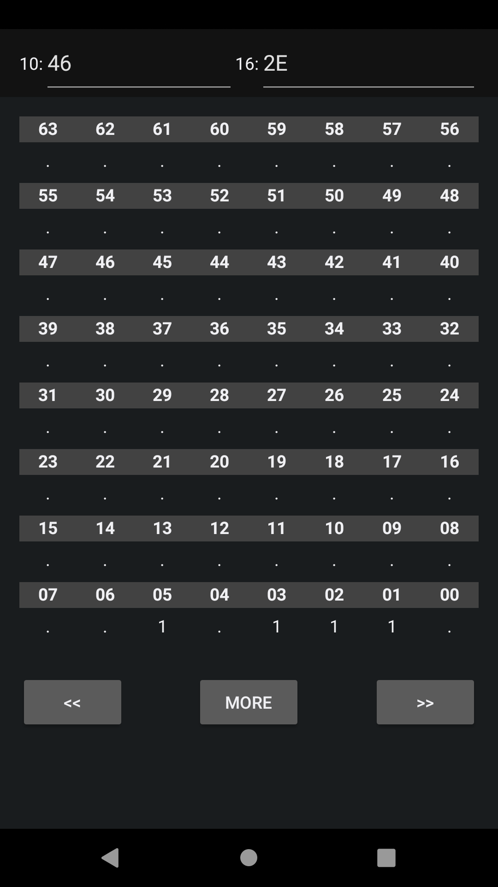
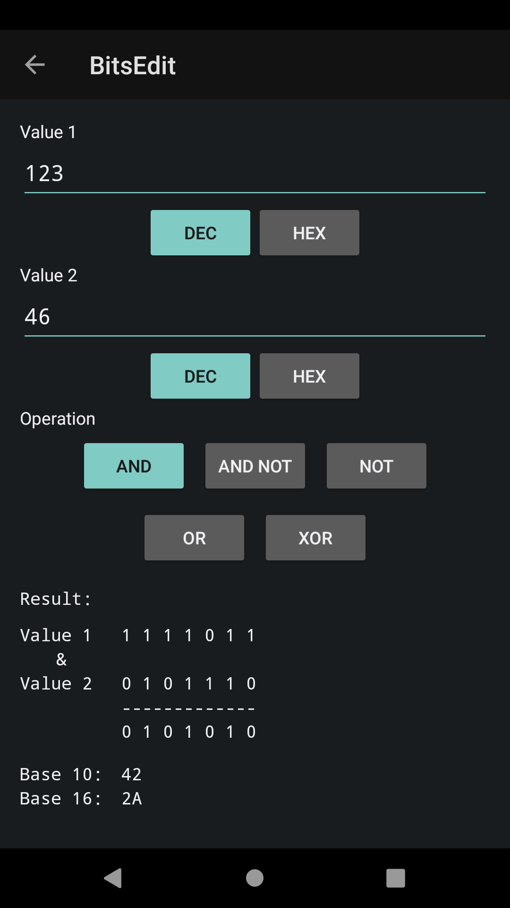

# BitsEdit
[][build]
[][license]

(GPL) Android Bits editor is a FREE software.

This software is distributed in the hope that it will be useful, but WITHOUT ANY WARRANTY.

This application offers the following features:
* Display of bits.
* Bit manipulation.
* Bit shifting (left/right).
* Bit operations like :
  * AND
  * NOT AND
  * NOT
  * OR
  * XOR

## Instructions

download the software :

	mkdir devel
	cd devel
	git clone git@github.com:Keidan/BitsEdit
	cd BitsEdit
 	Use with android studio

## Screenshots

	
## License
[GPLv3](https://github.com/Keidan/BitsEdit/blob/master/license.txt)

[build]: https://github.com/Keidan/BitsEdit/actions
[license]: https://github.com/Keidan/BitsEdit/blob/master/license.txt